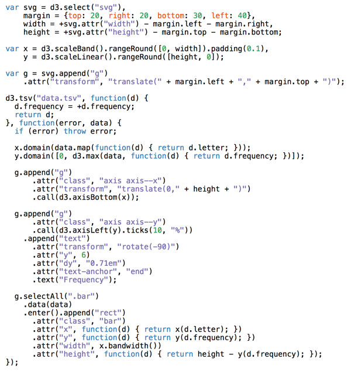
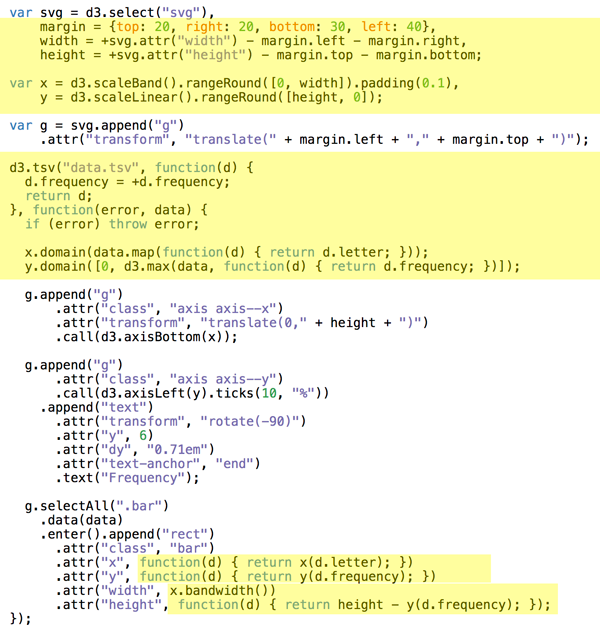
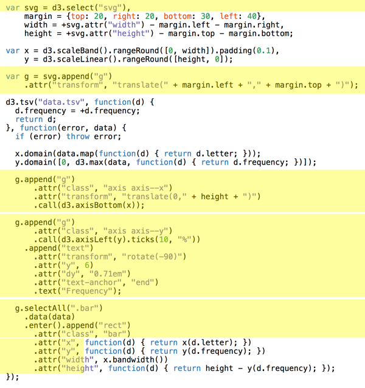
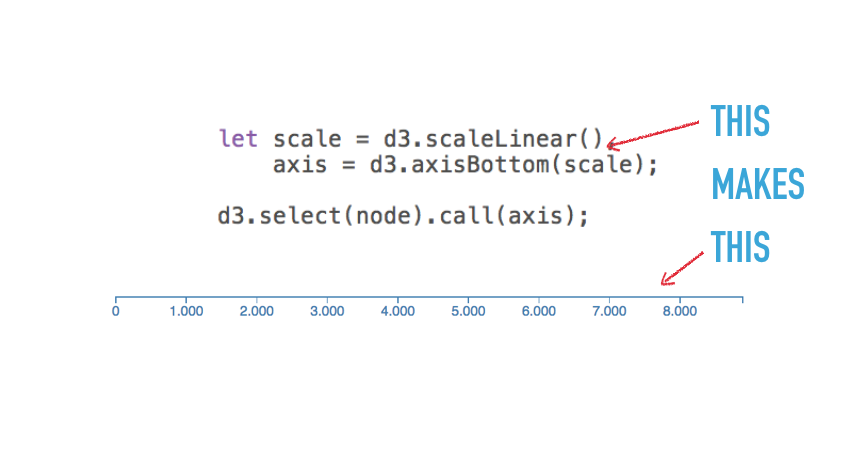
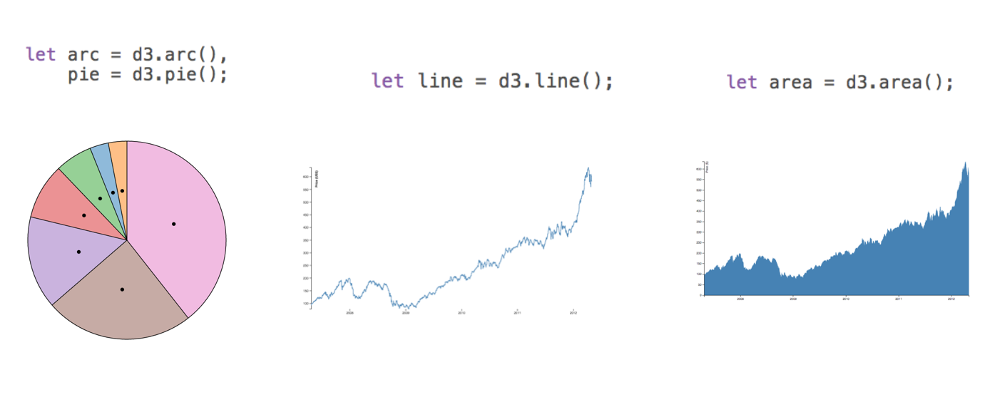
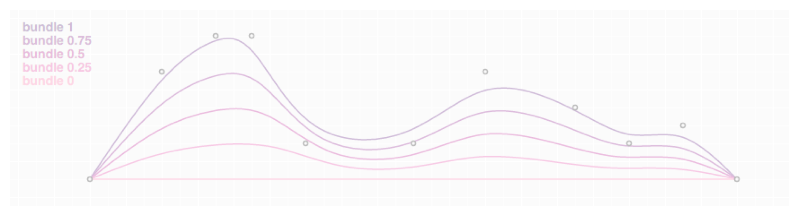

Welcome to the Dataviz section. 📈

You know all about React, Redux, and building apps out of components. Yesterday we talked about thinking in state machines, designing a good architecture, and built a gif watching app.

Today we're going to use those skills to build a data visualization.

But first you need to learn about D3, the undisputed champion of data visualization libraries.

# Why D3

Because D3 can do all of this 👇

<iframe src="https://d3js.org/" width="150%" height="450px" style="border: 0px; position: relative; left: -200px"></iframe>

D3 is the best library out there for custom data visualization. It comes with a rich ecosystem of functions for almost anything you can think of. From simple medians, to automatic axis generators, and force diagrams.

Most data visualization you see on the web is built with D3. The New York Times uses it, Guardian uses it, r/dataisbeautiful is full of it.

Where things get tricky, is learning it from scratch.

There are a few gotchas that trip people up and make examples look like magic. You've probably noticed this, if you ever looked at an example project built with D3. They're full of spaghetti code, global variables, and often aren't made to be maintainable.

Most examples are just one-off toys after all. It's art.

A lot of dataviz that *isn't* art, is charts and graphs. You'll often find that using D3 to build those, is too complicated. D3 gives you more power than you need.

If you want charts, I suggest using a charting library. Vx.js is a great choice.

Where many charting libraries fall short is customization. The API is limited, you can't do everything you want, and it gets easier to just build it yourself.

Take this barchart code, for example

```javascript
d3.tsv("data.tsv", function(d) {
  d.frequency = +d.frequency;
  return d;
}, function(error, data) {
  if (error) throw error;

  x.domain(data.map(function(d) { return d.letter; }));
  y.domain([0, d3.max(data, function(d) { return d.frequency; })]);

  g.append("g")
      .attr("class", "axis axis--x")
      .attr("transform", "translate(0," + height + ")")
      .call(d3.axisBottom(x));

  g.append("g")
      .attr("class", "axis axis--y")
      .call(d3.axisLeft(y).ticks(10, "%"))
    .append("text")
      .attr("transform", "rotate(-90)")
      .attr("y", 6)
      .attr("dy", "0.71em")
      .attr("text-anchor", "end")
      .text("Frequency");

  g.selectAll(".bar")
    .data(data)
    .enter().append("rect")
      .attr("class", "bar")
      .attr("x", function(d) { return x(d.letter); })
      .attr("y", function(d) { return y(d.frequency); })
      .attr("width", x.bandwidth())
      .attr("height", function(d) { return height - y(d.frequency); });
});
```

Can you tell what's going on? I'd need to read it pretty carefully.

# 3 key insights that help you learn D3.js from scratch

Somebody once asked me how to learn D3.js from scratch. I quipped that it took me writing a book to really learn it. It's one hell of a library.

Most people don't go that far. They don't have to. 

You start with a problem, find similar examples, do some copy pasta, tweak until it works and end up with a working visualization you don't understand. You'd be surprised how few people actually understand how their D3 dataviz works.

But really, there are only 3 key concepts you have to grok, to understand every D3 example out there. 😱

## 1) Data manipulation vs. DOM manipulation

All D3 examples are split into two parts: Data manipulation and DOM manipulation. First you prep your values, then you render.

You have to go through many examples to notice what's going on. Inference learning is hard. Most beginners miss this pattern and it makes D3 look more confusing than it is.

Let's take an example from [D3's docs](https://github.com/d3/d3/wiki/Gallery), a bar chart with a hover effect.

<iframe src="https://cdn.rawgit.com/mbostock/3885304/raw/a91f37f5f4b43269df3dbabcda0090310c05285d/index.html" width="100%" height="480" style="border: 0px; overflow: hidden"></iframe>

Mike Bostock, the creator of D3, built this chart in 43 lines of code. Here they are 👇



There are two parts to this code: Data manipulation and DOM manipulation.



Bostock here first prepares his data: 

- some sizing variables (margin, width, height)
- two scales to help with data-to-coordinates conversion (x, y)
- loads his dataset (d3.tsv) and updates his scales' domains
- uses scales to calculate attributes during DOM manipulation

In the DOM manipulation part, he puts shapes and objects into an SVG. This is the part you then see in the browser.



DOM manipulation in D3 happens via D3 selections. They're a lot like jQuery `$(something)`. Personally I like to do this part with React as described in my book, [React+D3v4](https://swizec.com/reactd3js).

Here Bostock does a few things

- selects the `<svg>` node (d3.select)
- appends a grouping `<g>` node (.append) with an SVG positioning attribute (translate)
- adds a bottom axis by appending a `<g>`, moving it, then calling `d3.axisBottom` on it. D3 has built-in axis generators
- adds a left axis using the same approach but rotating the ticks
- appends a text label "Frequency" to the left axis
- uses `selectAll.data` to make a virtual selection of `.bar` nodes and attach some data, then for every new data value (.enter), appends a `<rect>` node and gives it attributes

That last part is where people get lost. It looks like magic. I've been using D3 for years and it still looks like magic.

It's a declarative approach to rendering data. Works great, hard to understand. That's why I do it in React instead :)

You can think of `.enter` as a loop over your data and everything chained after `.enter` is your loop's body. Sort of like doing `data.map(d => append(rect).setManyAttributes())`

Savvy?

## 2) Scales

Scales are D3's most versatile concept. They help you translate between two different spaces. Like, mathematical spaces.

They're like the mathematical functions you learned about in school. A domain maps to a range using some sort of formula.


Colored shapes in the domain map to colors in the range. No formula for this one, which makes it an ordinal scale.

```javascript
let shapes = d3.scaleOrdinal()
	.domain(['red triangle', 'orange rectangle', ...)
	.range(['red', 'orange', ...)
```

[Play with scales on CodePen](https://codepen.io/swizec/pen/qxmMda)

Once you have this scale, you can use it to translate from shapes to colors. `shapes('red triangle')` returns `'red'` for example.

Many different types of scales exist. Linear, logarithmic, quantize, etc. Any basic transformation you can think of exists. The rest you can create by writing custom scales.

You're most often going to use scales to turn your data values into coordinates. But other use cases exist.

## 3) D3 layouts

Sure `.enter.append` looks like magic, but D3 layouts are the real mind=blown of the D3 ecosystem. They take your input data and return a full-featured visualization thing.

Like a force layout using forces between nodes to place them on the screen.

<iframe src="https://cdn.rawgit.com/mbostock/4062045/raw/5916d145c8c048a6e3086915a6be464467391c62/index.html" width="100%" height="480" style="border: 0px"></iframe>

Or a circle packing layout that neatly packs circles.

<iframe src="https://cdn.rawgit.com/mbostock/4063530/raw/fbadda6a3eaf72521f6f45cfa8e1d119bd2b0248/index.html" width="100%" height="480" style="border: 0px"></iframe>

I don't know how these work internally. I've yet to try building one for others to use. 

But here's a key insight about the magic of layouts: They're the data part.

You take a `forceLayout` for example and feed it your data. It returns an object with a `tick` event callback.

```javascript
var simulation = d3.forceSimulation()
    .force("link", d3.forceLink().id(function(d) { return d.id; }))
    .force("charge", d3.forceManyBody())
    .force("center", d3.forceCenter(width / 2, height / 2));
```

This `simulation` now handles everything about rendering nodes. Changes their positions on every `tick` callback.

But it is up to you to render them. A layout handles your dataviz in the abstract. You're still the one in control of rendering.

For a force layout, you have to update the DOM on every tick of the animation. For circle packing, you render it once.

It took me a while to get this and once I did, all the fancy looking visualizations started to make sense.

# Summary 

You need to grok 3 key insights for D3 to make sense. Once they click, a whole new world opens up.

1. Code is split into data and DOM manipulation
2. Scales are great and used a lot
3. You're always in control of rendering

# A few more cool things D3 can do

## Maps


[Choropleth map](https://bl.ocks.org/mbostock/4060606) of US unemployment rate.

## Axes



## Shapes

- Build the most common thing you need.
- Calculate coordinates.
- You do the rendering.





## Transitions

