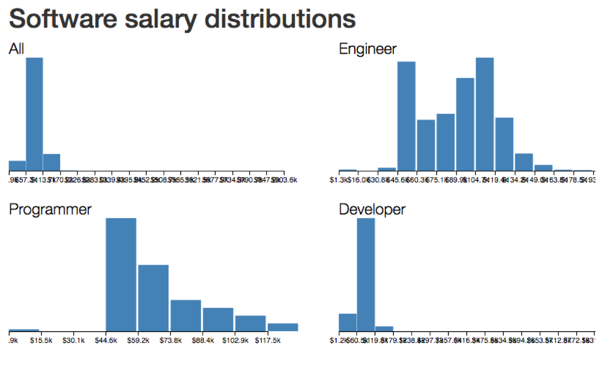
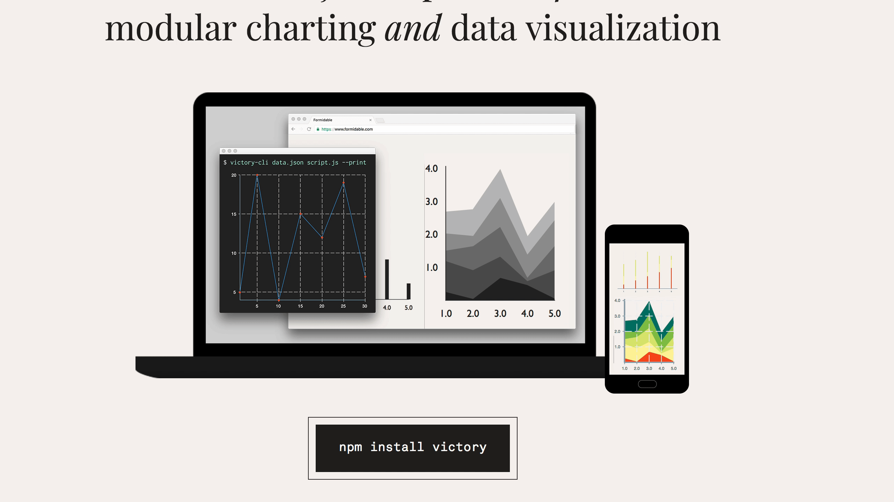
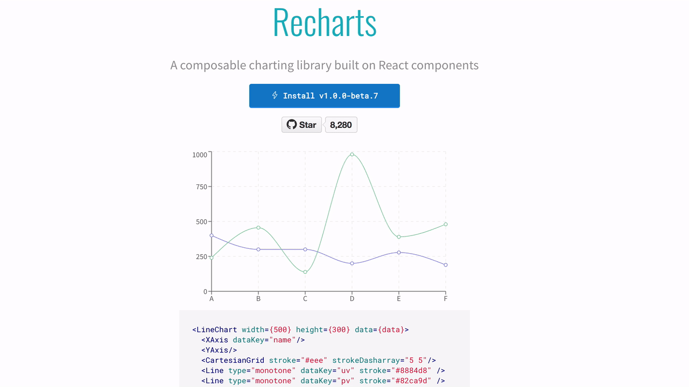
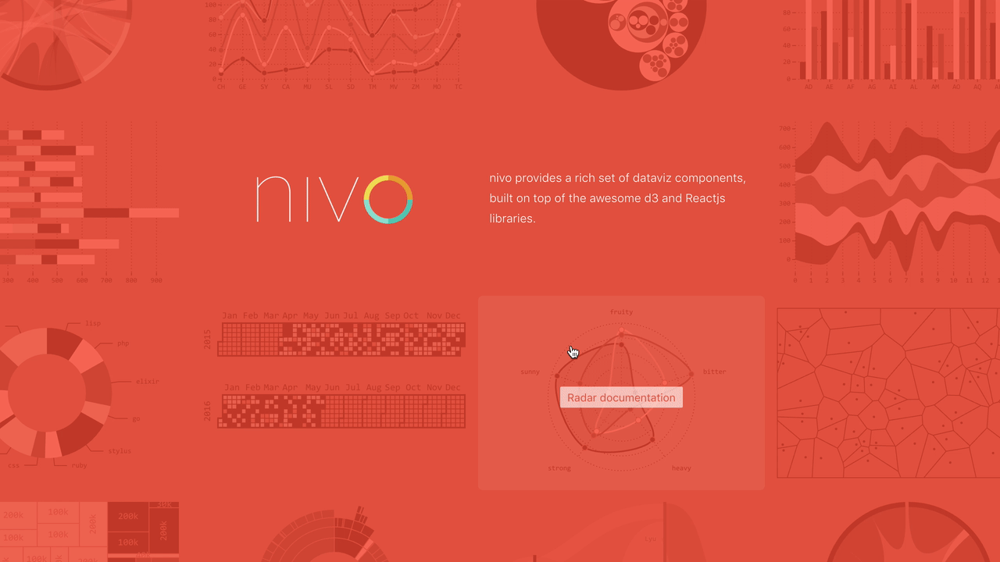
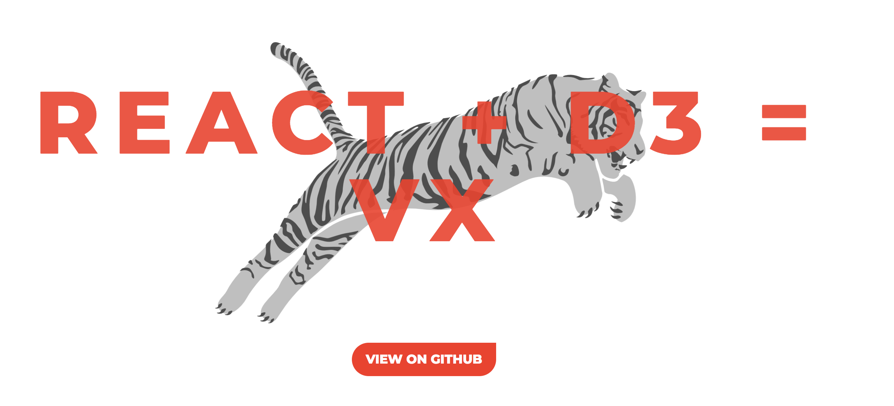
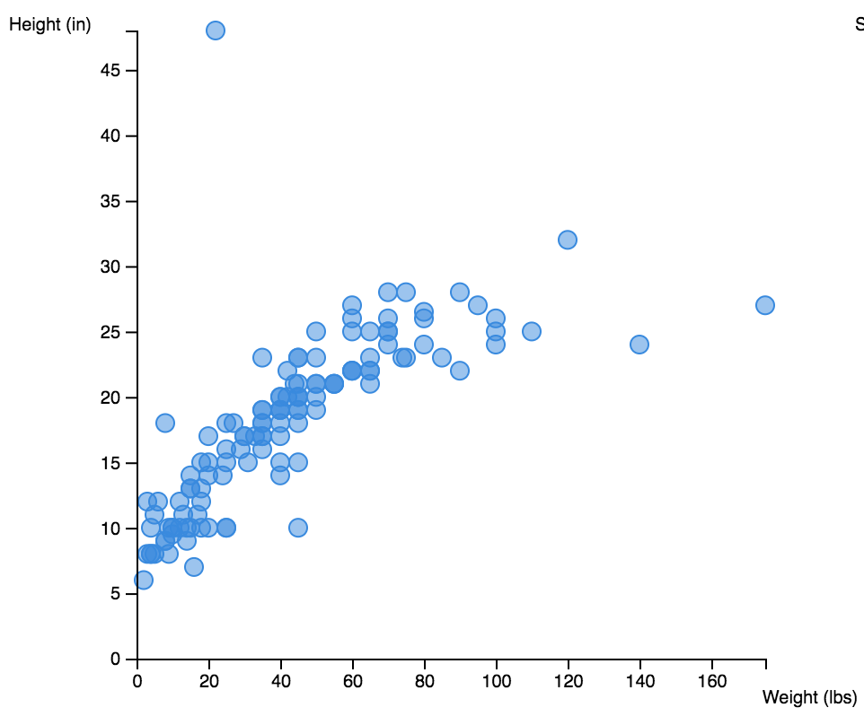

D3 is great out of the box. There's nothing inherently wrong with it at all. It's flexible and gets the job done. You don't *need* React nor any other library to create data visualizations.

So why use React? There's a few ways React makes your data visualization code even better.

# Why

## Declarative visualization

The idea behind declarative visualization is that you can focus on building your logic, not how to render something. Same as we discussed yesterday.

Take this animated alphabet for example. New letters animate in, old letters shuffle around, and dropped letters animate out. Each letter figures out how to do this on its own, you just render them in a loop.


[Try it live](http://swizec.github.io/react-d3-enter-exit-transitions/)

```jsx
class Alphabet extends Component {
    static letters = "abcdefghijklmnopqrstuvwxyz".split("");

    state = { alphabet: [] };

    componentDidMount() {
        d3.interval(() => {
            const shuffledLetters = d3
                .shuffle(Alphabet.letters)
                .slice(0, Math.floor(Math.random() * 18))
                .sort();
            this.setState({ alphabet: shuffledLetters });
        }, 1500);
    }

    render() {
        const { alphabet } = this.state;
        const letters = alphabet.map((d, i) => <Letter d={d} i={i} key={i} />);

        return (
            <g transform="translate(0, 200)">
                <ReactTransitionGroup component="g">
                    {letters}
                </ReactTransitionGroup>
            </g>
        );
    }
}
```

`ReactTransitionGroup` has changed its API so the full example 👆 needs some updating, but the core idea remains: Letters handle transitions, you render in a loop.

## Reusable viz components

Now imagine you've built a `<Histogram />` component. You can move it around just like you can a `<Button />` component. Feed it different data, still a histogram.



```jsx
class Dataviz extends Component {
    render() {
        return (
            <g transform={translate}>
                <Histogram
                    data={this.props.data}
                    value={d => d.base_salary}
                    x={0}
                    y={0}
                    width={400}
                    height={200}
                    title="All"
                />

                <Histogram
                    data={engineerData}
                    value={d => d.base_salary}
                    x={450}
                    y={0}
                    width={400}
                    height={200}
                    title="Engineer"
                />

                <Histogram
                    data={programmerData}
                    value={d => d.base_salary}
                    x={0}
                    y={220}
                    width={400}
                    height={200}
                    title="Programmer"
                />

                <Histogram
                    data={developerData}
                    value={d => d.base_salary}
                    x={450}
                    y={220}
                    width={400}
                    height={200}
                    title="Developer"
                />
            </g>
        );
    }
}
```

## No more spaghetti


# Using a library (and when not to)

The easiest way to achieve these benefits is to use a library. Something that comes with pre-built visualization components you can plug into your app and move on with life.

Most data visualization libraries are built on top of D3. They often give you basic charts and graphs, some customizability, and a world of pain when you stray from the beaten path.

That's why I rarely use them myself.

But if all you need is a simple chart, a library is your friend. Here are some of the most popular 👇

List borrowed from [a wonderful Smashing Magazine article](https://www.smashingmagazine.com/2018/02/react-d3-ecosystem/), because I like doing it myself from scratch 🤙

## Victory

> React.js components for modular charting and data visualization

[](http://formidable.com/open-source/victory/)

Victory offers low level components for basic charting and reimplements a lot of D3's API. Great when you need to create basic charts without a lot of customization. Supports React Native.

<iframe src="https://codesandbox.io/embed/3v3q013x36" style="width:100%; height:500px; border:0; border-radius: 4px; overflow:hidden;" sandbox="allow-modals allow-forms allow-popups allow-scripts allow-same-origin"></iframe>

## Recharts

> A composable charting library built on React components

[](http://recharts.org/)

Recharts looks similar to Victory. It comes with a pile of charting components, offers some customization, and seems to love animating everything by default.

<iframe src="https://codesandbox.io/embed/mmkrjl7qxp" style="width:100%; height:500px; border:0; border-radius: 4px; overflow:hidden;" sandbox="allow-modals allow-forms allow-popups allow-scripts allow-same-origin"></iframe>

## Nivo

> nivo provides a rich set of dataviz components, built on top of the awesome d3 and Reactjs libraries.

[](http://nivo.rocks)

Nivo is another attempt to bring you a set of basic charting components. Comes with great interactive documentation, support for Canvas and API rendering. Allows a lot of basic customization.

<iframe src="https://codesandbox.io/embed/n1wwkvq24" style="width:100%; height:500px; border:0; border-radius: 4px; overflow:hidden;" sandbox="allow-modals allow-forms allow-popups allow-scripts allow-same-origin"></iframe>

## VX

> vx is collection of reusable low-level visualization components. vx combines the power of d3 to generate your visualization with the benefits of react for updating the DOM.

[](https://vx-demo.now.sh/)

VX is the closest to the integration approaches we're going to discuss today. React for rendering, D3 for calculations. When you build a set of custom components for your organization, a flavor of VX is essentially what you come up with.

That's why I often recommend teams use VX when they need to get started quickly.

<iframe src="https://codesandbox.io/embed/k5853pryrv" style="width:100%; height:500px; border:0; border-radius: 4px; overflow:hidden;" sandbox="allow-modals allow-forms allow-popups allow-scripts allow-same-origin"></iframe>

## When not to use a library

Now, if you want to build something custom, something that delights and astounds, something that makes your users love you, then you will have to understand how combining React and D3 works under the hood. That's what we're here for today.

To quote [Marcos Iglesias](https://www.smashingmagazine.com/2018/02/react-d3-ecosystem/) because I agree with everything he said.

### Quality

> Let’s say we fix quality. We could aim to have a code base that is well tested, up to date with D3.js and with comprehensive documentation.

### Time

> If we think about **time**, a useful question to ask ourselves is, “Is this a long-term investment?” If the response is “yes,” then I would advise you to create a library based on D3.js and wrap it with React using the lifecycle methods approach. This approach separates our code by technologies and is more time-resistant.

But leads to lower code quality and worse UI performance.

### Scope

> When we deal with **scope**, we should think of whether what we need is a small number of basic charts, a one-off complex visualization or several highly customized graphics. In the first case, I would again choose the closest library to the specifications and fork it. For bespoke data visualizations that contain a lot of animations or interactions, building with regular D3.js and React is the best option.

### Cost

> Finally, the **cost** side of the decision is related to the budget and training of the team. What kinds of skills does your team have? If you have D3.js developers, they would prefer a clear separation between D3.js and React, so probably an approach using the lifecycle method wrapping would work great. However, if your team is mostly React developers, they would enjoy extending any of the current React-D3.js libraries.

Fundamentally, the more custom your visualization needs, the more necessary it becomes to roll your own code.

# How to build your own

Our visualizations are going to use SVG - an XML-based image format that lets us describe images in terms of mathematical shapes. For example, the source code of an 800x600 SVG image with a rectangle looks like this:

```html
<svg width="800" height="600">
    <rect width="100" height="200" x="50" y="20" />
</svg>
```

These four lines create an SVG image with a black rectangle at coordinates (50, 20) that is 100x200 pixels large. Black fill with no borders is default for all SVG shapes.

SVG is perfect for data visualization on the web because it works in all browsers, renders without blurring or artifacts on all screens, and supports animation and user interaction. You can see examples of interaction and animation later in this book.

But SVG can get slow when you have many thousands of elements on screen. We're going to solve that problem by rendering bitmap images with canvas. More on that later.

## React with SVG

Another nice feature of SVG is that it's just a dialect of XML - nested elements describe structure, attributes describe the details. The same principles that HTML uses.

That makes React's rendering engine particularly suited for SVG. Our 100x200 rectangle from before looks like this as a React component.

```jsx
const Rectangle = () => <rect width="100" height="200" x="50" y="20" />;

ReactDOM.render(<Rectangle />, document.getElementById("svg"));
```

You're right. This looks like tons of work for a static rectangle. But look closely. Even if you know nothing about React and JSX, you can look at that code and see that it's a Picture of a Rectangle.

Compare that to a pure D3 approach:

```javascript
d3
    .select("svg")
    .attr("width", 800)
    .attr("height", 600)
    .append("rect")
    .attr("width", 100)
    .attr("height", 200)
    .attr("x", 50)
    .attr("y", 20);
```

It's elegant, it's declarative, it looks like function call soup. It doesn't scream "Rectangle in an SVG" to me as much as the React example does.

You have to take your time and read the code carefully: first, we select the svg element, then we add attributes for width and height. After that, we append a rect element and set its attributes for width, height, x, and y.

Those 8 lines of code create HTML that looks like this:

```html
<svg width="800" height="600">
    <rect width="100" height="200" x="50" y="20" />
</svg>
```

Would've been easier to just write the HTML, right? Yes, for static images you're better off using Photoshop or something then exporting to SVG.

Either way, dealing with the DOM is not D3's strong suit. There's a lot of typing, code that's hard to read, it's slow when you have thousands of elements, and it's often hard to keep track of which elements you're changing. D3's enter-update-exit cycle is great in theory, but I personally never found it easy to use.

If you don't know what I just said, don't worry. We'll cover the enter-update-exit cycle in the animations example. Don't worry about D3 either. **I know it's hard**. I've written two books about it, and I still spend as much time reading the docs as writing the code. There's much to learn, and I'll explain everything as we go along.

D3's strong suit is its ability to do everything other than the DOM. There are many statistical functions, great support for data manipulation, and a bunch of built-in data visualizations. **D3 can calculate anything for us. All we have to do is draw it out.**

## The basic idea

Which is why we're going to follow this approach:

*   React owns the DOM
*   D3 calculates properties

This way, we can leverage React for SVG structure and rendering optimizations and D3 for all its mathematical and visualization functions.

Now let's look at two different ways to put them together: blackbox and full-feature.

## Blackbox components

Let's build an axis component. Axes are the perfect use-case for blackbox components. D3 comes with an axis generator bundled inside, and they're difficult to build from scratch.

They don't look difficult, but there are many tiny details you have to get just right.

### A quick blackbox example - a D3 axis

D3's axis generator takes a scale and some configuration to render an axis for us. The code looks like this:

<iframe src="https://codesandbox.io/embed/v6ovkow8q3" style="width:100%; height:500px; border:0; border-radius: 4px; overflow:hidden;" sandbox="allow-modals allow-forms allow-popups allow-scripts allow-same-origin"></iframe>

If this code doesn't make any sense, don't worry. There's a bunch of D3 to learn, and I'll help you out. If it's obvious, you're a pro! This workshop will be much easier to follow.

We start with a linear scale that has a domain `[0, 10]` and a range `[0, 200]`. You can think of scales as mathematical functions that map a domain to a range. In this case, calling `scale(0)` returns `0`, `scale(5)` returns `100`, `scale(10)` returns `200`. Just like middle school mathematics.

We create an axis generator with `axisBottom`, which takes a scale and is going to generate a bottom oriented axis – numbers below the line. You can also tweak settings for the number of ticks, their sizing, and their spacing.

Equipped with an axis generator, we select the svg element, append a grouping element, use a transform attribute to move it `10px` to the right and `30px` down, and invoke the generator with `.call()`.

### A quick blackbox example - a React+D3 axis

Now let's say we want to use that same axis code but as a React component. The simplest way is to use a blackbox component approach like this:

#### Blackbox version

<iframe src="https://codesandbox.io/embed/3xy2jr1y5m" style="width:100%; height:500px; border:0; border-radius: 4px; overflow:hidden;" sandbox="allow-modals allow-forms allow-popups allow-scripts allow-same-origin"></iframe>

Oh man! So much code! Is this really worth it? Yes, for the other benefits of using React in your dataviz. You'll see :)

We created an `Axis` component that extends React base `Component` class. We can't use functional stateless components for this because we need lifecycle hooks. More on those later.

Our component has a render method, which returns a grouping element (`g`) moved `10px` to the right and `30px` down using the transform attribute. Same as before.

We created a React Ref using `this.gRef = React.createRef()` and added it to our render via the `ref` attribute. This gives us an easy to use reference to the raw DOM node.

The body of `d3render` should look familiar. It's where we put code from the pure D3 example. Scale, axis, select, call. There's no need to append a grouping element; we're already there with `this.gRef.current`.

For the manual re-rendering part, we call `d3render` in `componentDidUpdate` and `componentDidMount`. This ensures that our axis re-renders every time React's engine decides to render our component. On `state` and `prop` changes usually.

That wasn't so bad, was it?

To make our axis more useful, we could get the scale and axis orientation from props. Perhaps even a label!

Try that as an exercise. Here's my solution 👇

[Peek after solving](https://codesandbox.io/s/5ywlj6jn4l)

#### HOC version

After the blackbox axis example above, you'd be right to think something like _"Dude, that looks like it's gonna get hella repetitive. Do I really have to do all that every time?"_

Yes, you do. But! We can make it easier with a higher order component - a HOC.

Higher order components are one of the best ways to improve your React code. When you see more than a few components sharing similar code, it's time for a HOC. In our case, that shared code would be:

*   rendering an anchor element
*   calling D3's render on updates

With a HOC, we can abstract that away into something called a class factory. It's an old concept coming back in vogue now that JavaScript has classes.

You can think of it as a function that takes some params and creates a class – a React component. Another way to think about HOCs is that they're React components wrapping other React components and a function that makes it easy.

Let's build a HOC for D3 blackbox integration.

A D3blackbox HOC looks like this:

<iframe src="https://codesandbox.io/embed/5v21r0wo4x" style="width:100%; height:500px; border:0; border-radius: 4px; overflow:hidden;" sandbox="allow-modals allow-forms allow-popups allow-scripts allow-same-origin"></iframe>

You'll recognize most of that code from earlier. We have `componentDidMount` and `componentDidUpdate` lifecycle hooks that call `D3render` on component updates. Render renders a grouping element as an anchor into which D3 can put its stuff.

Because D3render is no longer a part of the component, we have to use `.call` to give it the scope we want: this class, or rather this instance of the React component.

We've also made some changes to make render more flexible. Instead of hardcoding the `translate()` transformation, we take x and y props. `{ x, y } = this.props` takes x and y out of `this.props` using object decomposition, and we used ES6 string templates for the transform attribute.

Consult my [ES6 cheatsheet](https://es2017.io) for details on that.

Using our new `D3blackbox` HOC to make an axis looks like this:

```javascript
const Axis = D3blackbox(function() {
    const scale = d3
        .scaleLinear()
        .domain([0, 10])
        .range([0, 200]);
    const axis = d3.axisBottom(scale);

    d3.select(this.anchor.current).call(axis);
});
```

It’s the same rendering code as we had before. The only difference is that the function is wrapped in a `D3blackbox` call. This turns it into a React component.

You can play with this example on CodeSandbox, [here](https://codesandbox.io/s/5v21r0wo4x?from-embed).

### Practical exercise

Use the D3blackbox approach to take a random D3 example and render it as a React component.

Let's say [the barchart example for earlier](https://cdn.rawgit.com/mbostock/3885304/raw/a91f37f5f4b43269df3dbabcda0090310c05285d/index.html). You can use [this link](https://cdn.rawgit.com/mbostock/3885304/raw/a91f37f5f4b43269df3dbabcda0090310c05285d/data.tsv) for the data file.

## Full-feature integration

As useful as blackbox components are, we need something better if we want to leverage React's rendering engine. We're going to look at full-feature integration where React does the rendering and D3 calculates the props.

To do that, we're going to follow a 3-part pattern:

*   set up D3 objects as class properties
*   update D3 objects when component updates
*   output SVG in `render()`

It's easiest to show you with an example.

Let's build a scatterplot. Take a random array of two-dimensional data, render in a loop. Make magic.

Something like this 👇



*Ignore this stuff below, we're flying by the seat of our pants today. I'll update the page later.*

Let's build a rectangle that changes color based on prop values. We'll render a few of them to make a color scale.

Yes, it looks like a trivial example, but color-as-information is an important concept in data visualization.

I suggest following along in CodeSandbox for now.

<iframe src="https://codesandbox.io/embed/985xmjrvx4" style="width:100%; height:500px; border:0; border-radius: 4px; overflow:hidden;" sandbox="allow-modals allow-forms allow-popups allow-scripts allow-same-origin"></iframe>

We start with a Swatch component that draws a rectangle and fills it with a color.

### Swatch component

```jsx
const Swatch = ({ color, width, x }) => (
    <rect width={width} height="20" x={x} y="0" style={{ fill: color }} />
);
```

Looks like our earlier components, doesn't it? It's exactly the same: a functional stateless component that draws a rect element with some attributes - dimensions, position, and fill style.

Note that style is a dictionary, so we specify it with double curly braces: outer braces for a dynamic value, inner braces for a dictionary.

Then we need a Colors component. It follows the full-featured integration structure: D3 objects as properties, an updateD3 function, plus some wiring for updates and rendering.

### Colors component, pt1

```javascript
class Colors extends Component {
    colors = d3.schemeCategory20;
    width = d3.scaleBand()
          .domain(d3.range(20));
```

We start by inheriting from Component and defining defaults for D3 objects. this.colors is one of D3's predefined color scales. schemeCategory20 is a scale of 20 colors designed for categorization. It seemed like a good example, and you're welcome to try others.

this.width is a D3 scale designed for producing bands, d3.scaleBand. As mentioned earlier, scales map domains to ranges. We know our domain is 20 colors, so we can statically set the domain as `[1, 2, 3, ..., 20]` with `d3.range(20)`.

`d3.range` generates a counting array, by the way. We'll use that a lot.

We'll use `this.width` to calculate widths and positions of our color swatches. Here's a picture from D3 docs to help you visualize what `scaleBand` does:


### Colors component, pt2

```javascript
componentWillMount() {
 this.updateD3(this.props);
}

componentWillUpdate(newProps) {
 this.updateD3(newProps);
}

updateD3(props) {
 this.width.range([0, props.width]);
}
```

`componentWillMount` and `componentWillUpdate` are component lifecycle hooks. Can you guess when they run?

`componentWillMount` runs just before React's engine inserts our component into the DOM, and `componentWillUpdate` runs just before React updates it. That happens on any prop change or setState call.

Both of them call our `updateD3` method with the new value of props. We use it to update `this.width` scale's range. Doing so keeps the internal state of D3 objects in sync with React's reality. Without it, our component might render stale data.

Finally, we render a bunch of color swatches.

### Colors component, pt3

```javascript
render() {
    return (
    <g>
        {d3.range(20).map(i => (
            <Swatch color={this.colors[i]}
        width={this.width.step()}
        x={this.width(i)} />
         ))}
    </g>
    )
}
```

We create a grouping element to fulfill React's one child per component requirement, then render 20 swatches in a loop. Each gets a color from this.colors and a `width` and `x` from `this.width`.

After inserting into the DOM with ReactDOM, we get a series of 20 colorful rectangles.

Try changing the `width="400"` property of `<Colors />`. You'll see D3's scaleBand and our update wiring ensure the color strip renders correctly. For more fun, try changing the Colors component so it takes the color scale as a prop, then rendering multiple instances of `<Colors />` side-by-side.

# Practical exercise

Can you turn the color scale into a simple bar chart with random data? What about a checkerboard?

[Checkerboard solution](https://codesandbox.io/s/036y4jj30w)

[Barchart solution](https://codesandbox.io/s/r1r4myr5vq)

# About server-side-rendering SSR

<iframe src="https://server-side-d3-poc-mamdozxwze.now.sh/" width="120%" height="700" style="border: 0px"></iframe>

[Live example SSR React + D3 👉](https://server-side-d3-poc-mamdozxwze.now.sh/)

[GitHub link](https://github.com/Swizec/server-side-d3-poc)

You can use the full feature integration approach to support server-side rendering of your D3 charts. Because React handles the DOM and D3 handles the data, you can safely render on the server.

Here's the general approach 👇

1.  You hit reload
2.  Server reads `index.html` from [create-react-app](https://github.com/facebookincubator/create-react-app)
3.  Server reads local CSV file with data
4.  Server renders `<App />` into root HTML element
5.  Server sends the full `index.html` to your browser
6.  Browser shows HTML with the chart
7.  Browser loads remote CSV file with data
8.  Browser runs `ReactDOM.hydrate()` to render `<App />`
9.  `<App />` takes over the DOM and becomes a normal webapp

Some parts of this are efficient.

`ReactDOM.hydrate` avoids re-rendering parts of the DOM that were already rendered by your server. In our case that's everything except the axes.

Some parts of this are inefficient.

The server shouldn't need to read the CSV and HTML files on every request. You could do that on startup and save the strings in a variable. They're static.

We're also rendering `<App />` and running all of our React code twice. But this doesn't need to happen every time on the server. Cache that stuff!

## Adapting your React D3 app to server-side

Adjusting to server-side rendering requires a small mind shift in the way you build your chart. Usually I like to use `componentDidMount` in the `<App />` component to load data. Until data loads the app renders a `null`, after that it returns a chart component.

This makes apps easy to build and avoids issues with undefined data when rendering.

But it throws away all benefits of server-side rendering. With the `componentDidMount` approach, you're loading the fully rendered chart, replacing it with an empty component, then re-rendering it once data loads on the client.


Here's what you do instead: Accept data as props. Only load in `componentDidMount` if no data was given.

Like this 👇

```javascript
class App extends Component {
    constructor(props) {
        super(props);

        this.state = {
            data: (props.data || []).map(this.rowParse)
        };
    }

    dateParse = d3.timeParse("%d %b %Y");

    rowParse = ({ date, time, runner }) => ({
        date: this.dateParse(date),
        time: time
            .split(":")
            .map(Number)
            .reverse()
            .reduce((t, n, i) => (i > 0 ? t + n * 60 ** i : n)),
        runner
    });

    componentDidMount() {
        if (!this.state.data.length) {
            d3
                .csv(
                    "https://raw.githubusercontent.com/Swizec/server-side-d3-poc/master/src/data.csv"
                )
                .row(this.rowParse)
                .get(data => this.setState({ data }));
        }
    }

    // render stuff
}
```

In the `constructor` we copy data from props into `state`. That's because components that load their own data usually keep it in state and putting it there means fewer changes to the rest of your code.

`rowParse` is a helper method that turns individual rows from CVS strings into correct data types. Dates for `date`, seconds for `time` to win the marathon, and `runner` stays a string.

In `componentDidMount` we now check if data is already present. If it isn't, we load it and everything works the same as it always has.

## Hydrate _after_ data loads

The final piece of the puzzle is hydrating your app _after_ your data is done loading. You're already showing a chart, there's no need to be hasty and `ReactDOM.hydrate` as soon as your JavaScript loads.

You can't detect that your component already had children and avoid replacing them until you're ready. Instead, you can wait to hydrate in the first place.

```javascript
d3
    .csv(
        "https://raw.githubusercontent.com/Swizec/server-side-d3-poc/master/src/data.csv",
		    this.rowParse)
    .then(data =>
        ReactDOM.hydrate(<App data={data} />, document.getElementById("root"))
    );
```

And you have successfully solved the Flash of Doom seen in most D3 charts.
