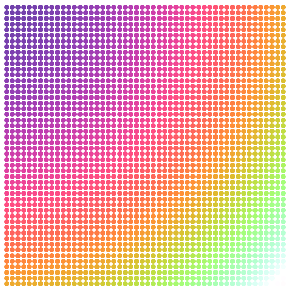
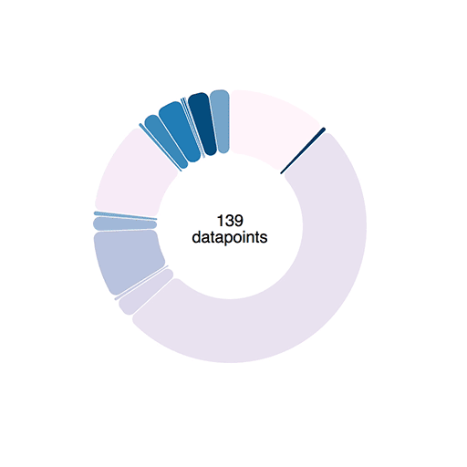
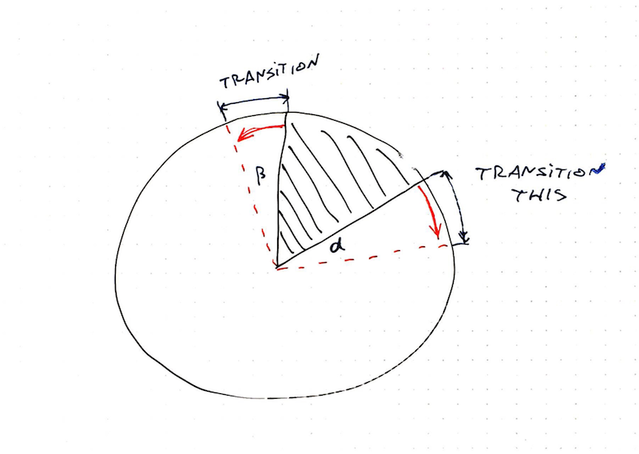

Welcome to the animation section. This is where the real fun begins. Demos that look cool and impress your friends.


You already know how React and D3 work together, so these demos are going to go faster. You know that we're using React for rendering SVG, and D3 for calculating props. You know how to make your dataviz interactive, and how to handle oodles of data.

Now you're going to learn how to make it dance. To build smooth transitions between states, build complex animations, and how to interact with the user in real-time. 60 frames per second baby!

Our general approach to animation goes like this: Render from state. Change state 60 times per second. Animation!

We're going to use two different ways of changing state so often. The first follows a game loop principle, which gives you more control, but is more tedious. The second is using D3 transitions, which is quicker to build, but gives you less control.

We're going to start with an example or two in CodeSandbox, then build something more involved. 

# Using a game loop for rich animation

I love game loops. It even sounds fun "game loop". Maybe it's just that whenever I build a game loop, the thing I'm building is fun to play with. 🤔

A game loop is an infinite loop where each iteration renders the next frame of your game or animation. You do your best to complete each iteration in 16 milliseconds and your user gets smooth animation.

As you can imagine, our challenge is to cram all physics and rendering into those 16 milliseconds. The more elements you're rendering, the harder it gets.

## A bouncing ball

Let's get our feet wet with my favorite childhood example: a bouncing ball.

I must have built dozens of them back in my Turbo Pascal days using BGI. Yes, those Turbo Pascal and BGI are from the 80's. No, I'm not that old, I just started young and with old equipment. Coding for DOS is easier when you're a kid than coding for Windows 95.

I suggest you follow along on CodeSandbox. Here's one I prepared for you earlier:

<iframe src="https://codesandbox.io/embed/rrwz67jl04" style="width:100%; height:500px; border:0; border-radius: 4px; overflow:hidden;" sandbox="allow-modals allow-forms allow-popups allow-scripts allow-same-origin"></iframe>

### Stub it out ☝️

### Render the ball

### Build the game loop

### Correct for time

# Using transitions for simple animation

Game loops are great when you need fine-grained control. But what, if you just want an element to animate a little bit when a user does something? You don't care about the details, you just want a little flourish.

That's where transitions come in.

Transitions are a way to animate SVG elements by saying "I want this property to change to this new value and take this long to do it". And you can use easing functions to make it look better.

I won't go into details about why easing functions are important, but they make movement look more natural. You can read more about it in Disney's 12 Basic Principles of Animation.

The two we can achieve with easing functions are:

- Squash and Stretch
- Slow In Slow Out

<iframe src="http://easings.net/" width="110%" height="400" style="border: 0px"></iframe>

[From easings.net](http://easings.net)

Let me show you how it works on a small example. We're drawing a field of 50 by 50 circles that "flash" when touched. The end result looks like there's a snake following your cursor.

## Rainbow snake

You can play with the code on CodeSandbox. Follow along as I explain how it works. Tweak parameters and see what happens :)

<iframe src="https://codesandbox.io/embed/vmjxjl7y73" style="width:100%; height:500px; border:0; border-radius: 4px; overflow:hidden;" sandbox="allow-modals allow-forms allow-popups allow-scripts allow-same-origin"></iframe>

### App

The App component needs only a render method that returns an SVG. Yes, that means it could've been a functional stateless component.

```jsx
  render() {
    const width = 600,
          N = 50,
          pos = d3.scalePoint()
                  .domain(d3.range(N))
                  .range([0, width])
                  .padding(5)
                  .round(true);

    return (
      <svg width="600" height="600">
        {d3.range(N).map(x =>
           d3.range(N).map(y =>
             <Dot x={pos(x)} y={pos(y)} key={`${x}-${y}`}
                  maxPos={width} />
        ))}
      </svg>
    )
  }
```

We're rendering a 600px by 600px SVG, with 50 nodes per row and column. We use D3's scalePoint for dot positioning because it does everything we need. Makes sure they're evenly spaced, gives them padding on the sides, and ensures coordinates are rounded numbers.

To render the grid, we use two nested loops going from 0 to N. d3.range builds an array for us so we can .map over it. We return a `<Dot>` component for each iteration.

Looking at this code: `x={pos(x)} y={pos(y)}` you can see why D3 scales are so neat. All positioning calculation boiled down to a 1-parameter function call. \o/

### Dot

The Dot component has more moving parts. It needs a constructor, a transition callback – flash, a color getter, and a render method.

```javascript
class Dot extends Component {
  constructor(props) {
    super(props);

    this.state = Object.assign({},
                               props,
                               {r: 5});
  }

  flash() {
        // transition code
  }

  get color() {
    // color calculation
  }

  render() {
    const { x, y, r, colorize } = this.state;

    return <circle cx={x} cy={y} r={r}
             ref="circle" onMouseOver={this.flash.bind(this)}
             style={{fill: colorize ? this.color : 'black'}} />
  }
}
```

We initialize state in the component constructor. The quickest approach is to copy all props to state, even though we don't need all props to be in state.

Normally, you want to avoid state and render all components from props. Functional principles, state is bad, and all that. But as Freddy Rangel likes to say "State is for props that change over time".

Guess what transitions are ... props that change over time :)

So we put props in state and render from state. This lets us keep a stable platform while running transitions. It ensures that changes re-rendering Dot from above, won't interfere with D3 transitions.

Not super important in our example because those changes never happen. But I had many interesting issues in this animated typing example. We'll look at that one later.

For the render method, we return an SVG <circle> element positioned at `(x, y)`, with a radius, an onMouseOver listener, and a style with the fill color depending on state.colorize.

### flash() – the transition

When you mouse over one of the dots, its flash() method gets called as an event callback. This is where we transition to pops the circle bigger, then back to normal size.

```javascript
  flash() {
    let node = d3.select(this.refs.circle),
      R = this.state.r * 4;

    this.setState({ colorize: true });

    node
      .transition()
      .attr("r", R)
      .duration(250)
      .ease(d3.easeCubicOut)
      .transition()
      .attr("r", R / 3.5)
      .duration(250)
      .ease(d3.easeCubicOut)
      .on("end", () =>
        this.setState({
          colorize: false,
          r: R / 3.5
        })
      );
  }
```

Here's what happens:

1. We `d3.select` the `<circle>` node. This enables D3 to take over the rendering of this particular DOM node
2. We `setState` to enable colorization. Yes, this triggers a re-render.
3. We start a `transition` that changes the r attribute to 20 pixels over a duration of 250 milliseconds.
4. We add an `easeCubicOut` easing function, which makes the animation look more natural
5. When the transition ends, we start another similar transition, but change `r` back to `5`.
6. When *that*'s done, we turn off colorization and trigger another re-render.

If our transition didn't return things back to normal, I would use the 'end' opportunity, to sync React component state with reality. Something like `this.setState({r: 20})`.

### get color() – the colorization

Colorization doesn't have anything to do with transitions, but I want to explain how it works. Mostly to remind you that high school math is useful.

Here's what the colored grid looks like:



Colors follow a radial pattern even though d3.interpolateWarm takes a single argument in the [0, 1] range. We achieve the pattern using circle parametrization.

`x^2 + y^2 = r^2`

Calibrate a linear scale to translate between `[0, maxR^2]` and `[0, 1]`, then feed it `x^2 + y^2` and you get the `interpolateWarm` parameter. Magic :)

```javascript
  get color() {
    const { x, y, maxPos } = this.state;

    const t = d3.scaleLinear()
                .domain([0, 1.2*maxPos**2])
                .range([0, 1]);

    return d3.interpolateWarm(t(x**2 + y**2));
  }
```

We calibrate the t scale to 1.2*maxPos**2 for two reasons. First, you want to avoid square roots because they're slow. Second, adding the 1.2 factor changes how the color scale behaves and makes it look better.

At least I think so. Experiment ;)

# Custom transitions with tweens



Transitions like we used above work using interpolators. For numbers, an interpolator is simple: A function that parametrizes changes to a single argument.

```javascript
let i = d3.interpolateNumber(10, 20);
i(0.0); // 10
i(0.2); // 12
i(0.5); // 15
i(1.0); // 20
```


D3 can interpolate everything from numbers, to colors, and even objects or strings. It does so by finding interpolatable parts of your argument and manipulating them linearly depending on the `t` parameter.

But sometimes you need custom interpolators – tweens.

Say you want to animate an arc shape. The path definition argument is a complex string 👇

```
M100.6434055594246,-99.8203632756589A8,8,0,0,1,112.2823856114007,-99.46188154973098A150,150,0,0,1,-104.56274177607584,107.54828233063364A8,8,0,0,1,-104.38099615277264,95.90520136696549L-64.39381262786019,59.38549403963366A8,8,0,0,1,-53.635344263429694,59.35696964757701A80,80,0,0,0,61.78081312913049,-50.82451307295977A8,8,0,0,1,62.30830828934212,-61.57007978883599Z
```

If that doesn't make sense, don't worry. I can't read it either. Maybe [Sarah Drasner](https://twitter.com/sarah_edo) can, she's an SVG goddess 🤔

[PS: she can](https://twitter.com/sarah_edo/status/971840965488119809)

When you try to transition a shape like that, funny things can happen. Sometimes arcs fly around the screen, sometimes you get an error.


Notice the arc wobble.


## Tweens to the rescue

Luckily, D3 lets us define custom transitions called tweens. To smoothly animate a piechart we're going to build an `arcTween`. Because piecharts are made of arcs.

The idea is to move from blindly transitioning path definitions, to transitioning angles on a pie slice. We're building a tween generator that takes some params and returns a tweening function.

Tweening functions are what makes transitions work, by the way. They take an argument, `t`, and return the value of your prop at that specific "time" of your transition.



Our tween generator is going to need:

1. `oldData`, the definition of our pie slice at the start of our transition
2. `newData`, the definition of our pie slice that we want to tween towards
3. `arc`, a [D3 arc generator](https://github.com/d3/d3-shape/blob/master/README.md#arcs)

Both `oldData` and `newData` come from a [D3 pie generator](https://github.com/d3/d3-shape/blob/master/README.md#pies). Their `startAngle` and `endAngle` is what we're interested in.

Our `arcTween` function uses these to build a tween method that we then feed into `attrTween`.

```javascript
// inspired from http://bl.ocks.org/mbostock/5100636
function arcTween(oldData, newData, arc) {
    const copy = { ...oldData };
    return function() {
        const interpolateStartAngle = d3.interpolate(
                oldData.startAngle,
                newData.startAngle
            ),
            interpolateEndAngle = d3.interpolate(
                oldData.endAngle,
                newData.endAngle
            );

        return function(t) {
            copy.startAngle = interpolateStartAngle(t);
            copy.endAngle = interpolateEndAngle(t);
            return arc(copy);
        };
    };
}
```

We make a `copy` of `oldData` so we don't change input data by accident, then we return a function. This function creates two interpolators with `d3.interpolate`.

Each interpolator starts from an `oldData` angle and moves towards a `newData` angle. One for start, one for end.

This function then returns our actual interpolation function. It takes the argument `t`, feeds it into our two interpolators, adjusts values on the `copy` object, feeds that into the `arc` generator, and returns a new path definition.

You use it like this 👇

```javascript
// Arc.js
d3
	.select(this.refs.elem)
	.transition()
	.duration(80)
	.attrTween("d", arcTween(this.state.d, newProps.d, this.arc))
	.on("end", () =>
	    this.setState({
	        d: newProps.d,
	        pathD: this.arc(newProps.d)
	    })
	);
```

Select an element, a `<path>`, start a transition, make it last `80` milliseconds, `attrTween` the path definition, `d`, attribute using the tween returned from `arcTween`.

We're going to use this `arcTween` in our example project later.