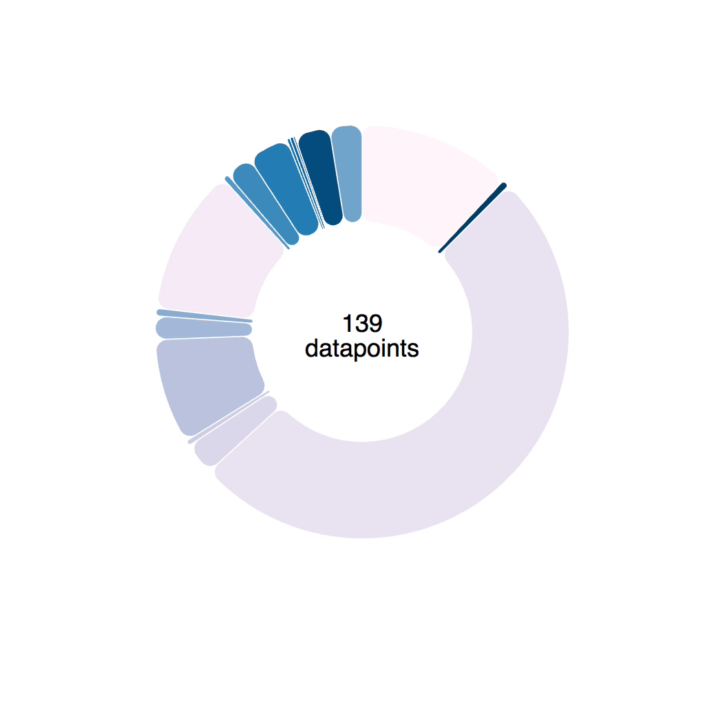

Welcome to the animation section. This is where the real fun begins. Demos that look cool and impress your friends.


You already know how React and D3 work together, so these demos are going to go faster. You know that we're using React for rendering SVG, and D3 for calculating props. You know how to make your dataviz interactive, and how to handle oodles of data.

Now you're going to learn how to make it dance. To build smooth transitions between states, build complex animations, and how to interact with the user in real-time. 60 frames per second baby!

Our general approach to animation goes like this: Render from state. Change state 60 times per second. Animation!

We're going to use two different ways of changing state so often. The first follows a game loop principle, which gives you more control, but is more tedious. The second is using D3 transitions, which is quicker to build, but gives you less control.

We're going to start with an example or two in CodeSandbox, then build something more involved.

# Using a game loop for rich animation

I love game loops. It even sounds fun "game loop". Maybe it's just that whenever I build a game loop, the thing I'm building is fun to play with. 🤔

A game loop is an infinite loop where each iteration renders the next frame of your game or animation. You do your best to complete each iteration in 16 milliseconds and your user gets smooth animation.

As you can imagine, our challenge is to cram all physics and rendering into those 16 milliseconds. The more elements you're rendering, the harder it gets.

## A bouncing ball

Let's get our feet wet with my favorite childhood example: a bouncing ball.

I must have built dozens of them back in my Turbo Pascal days using BGI. Yes, those Turbo Pascal and BGI are from the 80's. No, I'm not that old, I just started young and with old equipment. Coding for DOS is easier when you're a kid than coding for Windows 95.

I suggest you follow along on CodeSandbox. Here's one I prepared for you earlier:

<iframe src="https://codesandbox.io/embed/rrwz67jl04" style="width:100%; height:500px; border:0; border-radius: 4px; overflow:hidden;" sandbox="allow-modals allow-forms allow-popups allow-scripts allow-same-origin"></iframe>

### Stub it out ☝️

### Render the ball

### Build the game loop

### Correct for time

# Using transitions for simple animation

Game loops are great when you need fine-grained control. But what, if you just want an element to animate a little bit when a user does something? You don't care about the details, you just want a little flourish.

That's where transitions come in.

Transitions are a way to animate SVG elements by saying "I want this property to change to this new value and take this long to do it". And you can use easing functions to make it look better.

I won't go into details about why easing functions are important, but they make movement look more natural. You can read more about it in Disney's 12 Basic Principles of Animation.

The two we can achieve with easing functions are:

*   Squash and Stretch
*   Slow In Slow Out

<iframe src="http://easings.net/" width="110%" height="400" style="border: 0px"></iframe>

[From easings.net](http://easings.net)

Let me show you how it works on a small example. We're creating a component that swipes left or right when you click. You can think of it as a toggle button.

## A Ball swipe transition

<iframe src="https://codesandbox.io/embed/618mr9r6nr" style="width:100%; height:500px; border:0; border-radius: 4px; overflow:hidden;" sandbox="allow-modals allow-forms allow-popups allow-scripts allow-same-origin"></iframe>

Just like with earlier examples, our goal is to build a component that's fully controlled by its props. We're still using React for rendering and D3 for calculating things, but we have to mix approaches.

*   React controls the DOM
*   D3 takes over during transition
*   React regains control

We're using `state` as a staging area for our prop changes. That allows us to apply changes over time.

A 4-step approach develops:

1.  Copy relevant props into state
2.  Render from state
3.  Use D3 transitions in `componentDidUpdate`
4.  Update state when transition ends

It's important to tell React what's going on after we're done updating the DOM. Otherwise it gets confused and might start throwing errors about DOM nodes not matching their React state.

### Practical exercise

Fork the sandbox above and add a similar transition on the vertical axis. Or maybe a circle size transition.

Try different easing functions as well. [Here](https://github.com/d3/d3/blob/master/API.md#easings-d3-ease)'s a list of all that exist.

# A note on transition and animation performance

JavaScript transitions and animations are great when you need a lot of control over your transitions. Or when you need to stack and coordinate different animations.

But they have a big flaw: No GPU optimization.

When you run into trouble depends on what exactly your'e doing, but eventually you're going to struggle with UI lag and jitteriness. You can solve this by using CSS transitions instead.

The approach is similar, even easier in some cases. You don't have to worry about props and state at all, just set up the transition in your CSS and the browser will handle everything. You can render the same old way.

## Why even use D3 transitions then?

Good question!

Think of it as a spectrum of control and performance.

Game loop gives you most control and least performance. You're running React's full rendering engine on every update.

D3 transition gives you a lot of control and decent performance. You're running javascript for transitions, but updating the DOM directly.

CSS transition gives you least control and best performance. You change props and the GPU optimized CSS engine handles the rest.

There are ways to make both game loops and D3 transitions more or less performant, but consider whether it's worth it to go through all that trouble.

# Custom transitions with tweens


Transitions like we used above work using interpolators. For numbers, an interpolator is simple: A function that parametrizes changes to a single argument.

```javascript
let i = d3.interpolateNumber(10, 20);
i(0.0); // 10
i(0.2); // 12
i(0.5); // 15
i(1.0); // 20
```

D3 can interpolate everything from numbers, to colors, and even objects or strings. It does so by finding interpolatable parts of your argument and manipulating them linearly depending on the `t` parameter.

But sometimes you need custom interpolators – tweens.

Say you want to animate an arc shape. The path definition argument is a complex string 👇

```
M100.6434055594246,-99.8203632756589A8,8,0,0,1,112.2823856114007,-99.46188154973098A150,150,0,0,1,-104.56274177607584,107.54828233063364A8,8,0,0,1,-104.38099615277264,95.90520136696549L-64.39381262786019,59.38549403963366A8,8,0,0,1,-53.635344263429694,59.35696964757701A80,80,0,0,0,61.78081312913049,-50.82451307295977A8,8,0,0,1,62.30830828934212,-61.57007978883599Z
```

If that doesn't make sense, don't worry. I can't read it either. Maybe [Sarah Drasner](https://twitter.com/sarah_edo) can, she's an SVG goddess 🤔

[PS: she can](https://twitter.com/sarah_edo/status/971840965488119809)

When you try to transition a shape like that, funny things can happen. Sometimes arcs fly around the screen, sometimes you get an error.



Notice the arc wobble.

## Tweens to the rescue

Luckily, D3 lets us define custom transitions called tweens. To smoothly animate a piechart we're going to build an `arcTween`. Because piecharts are made of arcs.

The idea is to move from blindly transitioning path definitions, to transitioning angles on a pie slice. We're building a tween generator that takes some params and returns a tweening function.

Tweening functions are what makes transitions work, by the way. They take an argument, `t`, and return the value of your prop at that specific "time" of your transition.


Our tween generator is going to need:

1.  `oldData`, the definition of our pie slice at the start of our transition
2.  `newData`, the definition of our pie slice that we want to tween towards
3.  `arc`, a [D3 arc generator](https://github.com/d3/d3-shape/blob/master/README.md#arcs)

Both `oldData` and `newData` come from a [D3 pie generator](https://github.com/d3/d3-shape/blob/master/README.md#pies). Their `startAngle` and `endAngle` is what we're interested in.

Our `arcTween` function uses these to build a tween method that we then feed into `attrTween`.

```javascript
// inspired from http://bl.ocks.org/mbostock/5100636
function arcTween(oldData, newData, arc) {
    const copy = { ...oldData };
    return function() {
        const interpolateStartAngle = d3.interpolate(
                oldData.startAngle,
                newData.startAngle
            ),
            interpolateEndAngle = d3.interpolate(
                oldData.endAngle,
                newData.endAngle
            );

        return function(t) {
            copy.startAngle = interpolateStartAngle(t);
            copy.endAngle = interpolateEndAngle(t);
            return arc(copy);
        };
    };
}
```

We make a `copy` of `oldData` so we don't change input data by accident, then we return a function. This function creates two interpolators with `d3.interpolate`.

Each interpolator starts from an `oldData` angle and moves towards a `newData` angle. One for start, one for end.

This function then returns our actual interpolation function. It takes the argument `t`, feeds it into our two interpolators, adjusts values on the `copy` object, feeds that into the `arc` generator, and returns a new path definition.

You use it like this 👇

```javascript
// Arc.js
d3
    .select(this.refs.elem)
    .transition()
    .duration(80)
    .attrTween("d", arcTween(this.state.d, newProps.d, this.arc))
    .on("end", () =>
        this.setState({
            d: newProps.d,
            pathD: this.arc(newProps.d)
        })
    );
```

Select an element, a `<path>`, start a transition, make it last `80` milliseconds, `attrTween` the path definition, `d`, attribute using the tween returned from `arcTween`.

## Hybrid animations with game loop transitions

This seguays nicely into a new technique I discovered recently: Hybrid animations.


Hybrid animations combine what you've already learned about animating with React and D3 into a single approach. Use D3 transitions to drive the animation and React's rendering via state updates to render each frame.

Let's give it a shot :)

Here's a CodeSandbox with almost everything in place to transition a donut chart to a bar chart. Silly example but also the one way I've actually used this technique IRL.

<iframe src="https://codesandbox.io/embed/ojwyojrzx9?fontsize=14" style="width:100%; height:500px; border:0; border-radius: 4px; overflow:hidden;" sandbox="allow-modals allow-forms allow-popups allow-scripts allow-same-origin"></iframe>

We render a pie chart filled with random data. It keeps some local state (radius and roundness). Each arc is a new React component.

Your job is to create a transition in `startTransition` that changes the radius from `100` to `11000` over some time duration. That's a big enough radius that the donut chart ends up looking flat.

Use the `round` flag to decide whether you're transition to the small or big radius. Keep in mind that you can start a D3 transition on any selection even if it isn't selecting anything.

Here's my solution 👉 [click](https://codesandbox.io/s/llpk084r69)

Try adding an easing function :)
