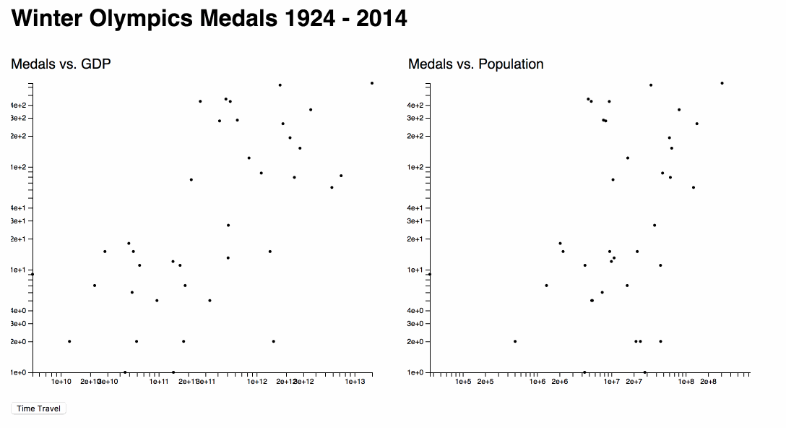

It's time to build something cool. We're going to build a data visualization of the Winter Olympics Medals. Because the olympics are happening just now.



I know it doesn't look too shiny, but it's the only good dataset I could find. FIS, the skiing organization, publishes all results onine ... in a PDF.

Parsing PDFs is hard so we're doing medals :)

We're using our usual approach 👇

1. Swizec explains what we're going to do
2. Swizec codes a part of it and makes a commit
3. You fill in the blanks
4. Swizec shows you how to fill in the blanks 

The following is an outline of what we're doing to help us focus.

We're going to copypasta a lot of data manipulation code from my original repo. Writing allt that isn't fun and is often the most time consuming part of building a dataviz project.

## Clone starter repo

[winter olympics starter repo](https://github.com/Swizec/winter-olympics-feb-2018-workshop)

```
$ cd
$ yarn/npm install
```

It has all the dependencies we need and some basic code to get us going.

## Basic Redux boilerplate

## Load and parse data

## Render a scatterplot

### Create axes
#### Build a general axis component
#### Use it for bottom axis
#### Use it for left axis

### Add datapoints
#### Read data from redux store
#### Render in a loop

## Add a 2nd scatterplot
### Maybe build a line graph instead 

## Animate history of olympics
### Tweak medalsSelector to get per year data
### Add button to start animation
### Call action in interval to walk through years
#### Make sure you don't skip years or get out of sync with reality

